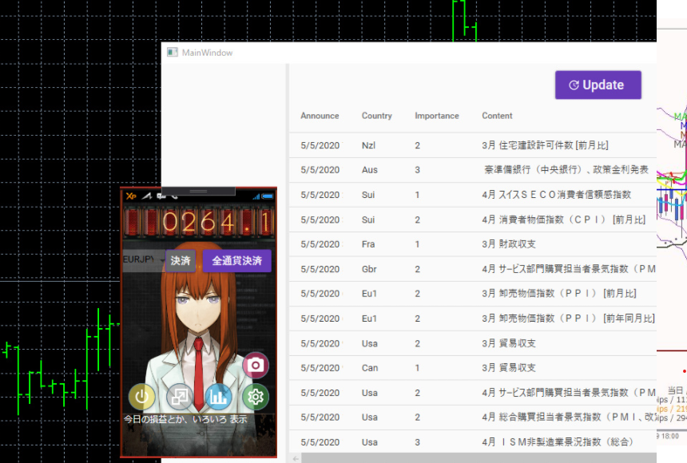

# Amadeus2

[Amadeus1](https://github.com/azarasi1226/Amadeus)での
MQL5でのUI開発地獄すぎるので心が折れました。  
Windowsクライアントアプリの練習ついでにC#のWPFで作り直すことに。

## Image

## 機能
* [昔作った経済指標ビュアー](https://github.com/azarasi1226/keizaisihyou)と連携
* MQL5で扱えなかった解像度に対応できたので画面が超きれいに...

### 一言
C#しゅごい